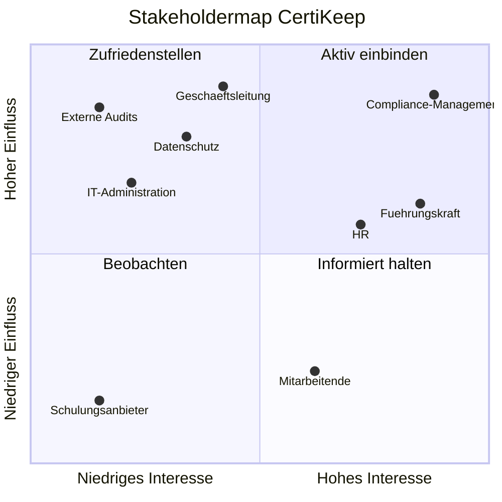

# 3 Stakeholder, Ermittlungsziele und Annahmen

> Eingeführt in V0.1 · zuletzt geändert in V0.2 (in Arbeit)

**Stand der Erkenntnisse:** Die Stakeholdermap, die Ermittlungsziele und die Annahmen beruhen auf einer Desk-Analyse der Projektgruppe mit KI-Unterstützung (siehe KI-Review-Spur, KR-14 bis KR-20). Sie sind noch nicht mit echten Stakeholdern bestätigt. Das Event Storming (Kapitel 4) prüft sie ein erstes Mal.

## 3.1 Stakeholdermap

| Stakeholder / Rolle | Hauptinteresse | Einfluss | Interesse | Quadrant |
|---|---|---|---|---|
| Compliance-Manager:in | Vollständige, jederzeit abrufbare Nachweise für gesetzliche und betriebliche Standards sowie rechtssichere Audit-Reports ohne manuellen Rechercheaufwand. | hoch | hoch | aktiv einbinden |
| Führungskraft | Übersicht über den Zertifizierungsstatus des eigenen Teams zur Vermeidung von Ausfällen oder Fristversäumnissen bei kritischen Qualifikationen. | mittel | hoch | aktiv einbinden |
| HR / Personalabteilung | Aktuelle Nachweise bei Eintritt, Rollenwechsel und Austritt sowie planbare Schulungen und Schulungsbudgets. | mittel | hoch | aktiv einbinden |
| Geschäftsleitung (Auftraggeberin) | Keine Haftungs- oder Betriebsrisiken durch fehlende Nachweise bei vertretbaren Kosten für Einführung und Betrieb. | hoch | mittel | zufriedenstellen |
| Datenschutzberater:in | Rechtmässige Bearbeitung der Personendaten nach nDSG: nur nötige Daten, klare Zugriffsrechte, festgelegte Löschfristen. | hoch | mittel | zufriedenstellen |
| Externe Auditor:in / Aufsicht | Vollständige und überprüfbare Nachweise in kurzer Zeit. Das Werkzeug selbst ist für sie zweitrangig. | hoch | niedrig | zufriedenstellen |
| IT-Administrator:in | Nahtlose Integration in bestehende Unternehmens-Systeme (z. B. HR-Software, Identity Provider via SSO), hohe Datensicherheit und geringer Wartungsaufwand. | hoch | niedrig | zufriedenstellen |
| Mitarbeiter:in | Einfache Einsicht in die eigenen Zertifikate, rechtzeitige Benachrichtigungen vor Ablauf sowie unkomplizierter Upload neuer Nachweise. | niedrig | mittel | informiert halten |
| Schulungsanbieter | Rechtzeitige Buchungen für Erneuerungskurse. | niedrig | niedrig | beobachten |

**Verbindliche Rollenbezeichnungen:** Die Bezeichnungen in der ersten Spalte gelten im ganzen Pflichtenheft. Synonyme wie «Teamleiter» oder «Compliance & Audit Manager» werden nicht mehr verwendet. Das Glossar (Kapitel 5) definiert die Rollen genauer.

*Hinweis zur Grafik:* Bei «mittel» entscheidet die Tendenz über den Quadranten. Massgebend ist die Spalte «Quadrant» in der Tabelle.

### Bemerkungen zur Einordnung

- **Mitarbeiter:innen haben nur mittleres Interesse.** Für sie ist ein Zertifikat eher eine Pflicht als ein Anliegen. Einzeln haben sie wenig Einfluss. Gemeinsam entscheiden sie aber über den Erfolg: Ohne ihre Uploads bleiben die Daten lückenhaft (siehe A-02).
- **Die IT-Administrator:in hat hohen Einfluss.** Sie kann den Betrieb aus Sicherheitsgründen ablehnen. Am Nutzen von CertiKeep ist sie aber kaum interessiert.
- **Externe Auditor:innen haben hohen Einfluss, aber wenig Interesse am System.** Sie können Sanktionen auslösen. Sie wollen aber nur Nachweise sehen, nicht das Werkzeug.

## 3.2 Besonders wichtige Stakeholder

| Stakeholder | Begründung |
|---|---|
| Compliance-Manager:in | Sie verantwortet den Nachweisprozess und nimmt CertiKeep fachlich ab. Ihre Anforderungen bestimmen, was ein «gültiger Nachweis» ist. |
| Führungskraft | Sie muss auf die Erinnerung reagieren und die Erneuerung organisieren. An ihrem Verhalten hängt die MVP-Hypothese (siehe 1.2). |

## 3.3 Ermittlungsziele

Ein Ermittlungsziel ist gut, wenn es entscheidungsrelevant und prüfbar ist. Entscheidungsrelevant heisst: Nach der Ermittlung entscheiden wir etwas anders als vorher. Prüfbar heisst: Am Ende wissen wir, ob wir eine Antwort haben.

| ID | Wir möchten herausfinden … | … um festlegen zu können, … | Woran wir erkennen, dass wir eine Antwort haben | Wen fragen | Technik |
|---|---|---|---|---|---|
| EZ-01 | wie viele Tage vor dem Ablauf eine Führungskraft die Erinnerung braucht, um eine Erneuerung zu organisieren | wie lang die Standard-Vorwarnfrist ist. Die heutigen 30 Tage sind eine unbelegte Annahme. | Wir haben pro Zertifikatsart eine Zahl in Tagen. | Führungskraft, HR | Event Storming |
| EZ-02 | wer heute prüft, ob ein Nachweis gültig ist, und wie lange diese Prüfung dauern darf | ob die Freigabe durch Compliance-Manager:innen (Story 2.2) Pflicht ist und ins MVP gehört | Wir kennen die prüfende Rolle und eine maximale Prüfdauer. | Compliance-Manager:in | Event Storming |
| EZ-03 | welche Nachweise in welcher Form externe Auditor:innen verlangen | was der Audit-Report enthält und wie lange Nachweise aufbewahrt werden | Wir haben eine Liste der Pflichtangaben und eine Aufbewahrungsdauer. | Externe Auditor:in, Compliance-Manager:in | Dokumentenanalyse |

**Warum zwei Techniken:** EZ-01 und EZ-02 betreffen Abläufe, an denen mehrere Rollen beteiligt sind. Dafür eignet sich ein gemeinsamer Workshop wie das Event Storming. Bei EZ-03 stehen die Anforderungen in bestehenden Dokumenten, zum Beispiel in Prüfberichten und Normen. Dafür ist die Dokumentenanalyse die passende Technik.

## 3.4 Annahmen

| ID | Annahme | Risiko, falls falsch | Wie wir sie prüfen |
|---|---|---|---|
| A-01 | Das Problem ist die fehlende Erinnerung, nicht fehlende Schulungstermine. | **hoch:** Das MVP wirkt nicht, obwohl es technisch funktioniert. | MVP-Pilot (siehe 1.2) |
| A-02 | Mitarbeiter:innen laden ihre Nachweise selbst hoch. | **hoch:** Die Daten bleiben lückenhaft. | Event Storming, danach MVP-Pilot |
| A-03 | Alle Mitarbeiter:innen haben eine geschäftliche E-Mail-Adresse. | **mittel:** In Produktion, Logistik oder Gastronomie fehlt sie oft. Dann erreicht die Erinnerung niemanden. | Rückfrage bei HR |
| A-04 | Zertifikate enthalten keine besonders schützenswerten Personendaten. | **mittel:** Ein arbeitsmedizinischer Tauglichkeitsnachweis wäre zum Beispiel ein Gesundheitsdatum. Dann gelten strengere Regeln nach nDSG. | Rückfrage bei der Datenschutzberater:in |
| A-05 | Die Auftraggeberin führt heute eine Nachweisliste, zum Beispiel in Excel. | **mittel:** Ohne Liste lässt sich die Ausgangslage für das MVP nicht messen. | Rückfrage bei der Compliance-Manager:in |
