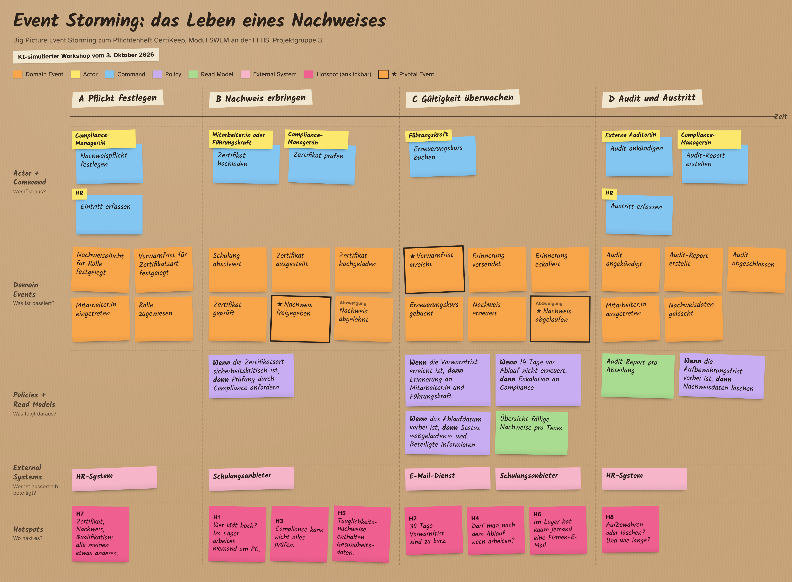

# 4 Ermittlung: Event Storming

> Eingeführt in V0.2 (in Arbeit)

> **Hinweis:** Dieser Workshop ist **KI-simuliert**. Eine KI (Claude) hat alle Rollen gespielt. Die Ergebnisse sind deshalb Hypothesen, keine bestätigten Aussagen von Stakeholdern. Sie werden mit echten Personen geprüft (siehe 4.8).

Zum Workshop gibt es zwei Webseiten:

- **Board mit Hotspots:** [`event-storming/index.html`](../event-storming/index.html), online unter <https://limrill.github.io/certikeep-pflichtenheft/event-storming/>
- **Vortragsansicht in vier Schritten:** [`event-storming/vortrag.html`](../event-storming/vortrag.html), online unter <https://limrill.github.io/certikeep-pflichtenheft/event-storming/vortrag.html>

Die Online-Adressen funktionieren, sobald GitHub Pages für das Repository eingeschaltet ist.

## 4.1 Warum Event Storming

Event Storming ist ein Workshop-Format. Alle Beteiligten schreiben auf Zettel, was im Fachbereich passiert. Daraus entsteht gemeinsam ein Zeitstrahl. Die Methode macht sichtbar, wo Rollen sich widersprechen und wo niemand eine Antwort hat.

Für CertiKeep passt sie aus zwei Gründen:

- **Die Ermittlungsziele EZ-01 und EZ-02 betreffen Abläufe mit mehreren Rollen.** Die Vorwarnfrist hängt von Führungskraft, HR und Schulungsanbieter ab. Die Prüfung der Nachweise betrifft Mitarbeiter:in und Compliance-Manager:in. Ein gemeinsamer Workshop bringt diese Sichten an einen Tisch.
- **Der Fachbereich hat einen klaren Lebenszyklus.** Ein Nachweis wird gefordert, erbracht, überwacht, erneuert und am Ende gelöscht. Ereignisse in der Vergangenheitsform bilden diesen Ablauf direkt ab.

Für EZ-03 (Anforderungen der Audits) ist Event Storming nicht die passende Technik. Die Antworten stehen in Prüfberichten und Normen. Dafür ist eine Dokumentenanalyse vorgesehen (siehe 3.3).

## 4.2 Leitfaden

Der Workshop folgt dem Format «Big Picture Event Storming» in sieben Schritten. In Klammern stehen die englischen Fachbegriffe der Methode. Sie werden auch auf dem Board verwendet.

| Schritt | Was passiert | Leitfrage |
|---|---|---|
| 1 Rahmen setzen | Start- und Endpunkt festlegen. Die Ermittlungsziele vorstellen. | Wo beginnt und wo endet die Geschichte eines Nachweises? |
| 2 Ereignisse sammeln (Chaotic Exploration) | Alle schreiben für sich Ereignisse (Domain Events) auf orange Zettel, in der Vergangenheitsform. | Was ist passiert, das für das Unternehmen wichtig ist? |
| 3 Zeitstrahl bilden (Enforcing the Timeline) | Die Zettel kommen in eine Reihenfolge. Doppelte und Synonyme werden geklärt. Schlüsselereignisse (Pivotal Events) werden markiert. | Was passiert vor was? Meinen zwei Zettel dasselbe? |
| 4 Personen und Systeme ergänzen (People and Systems) | Gelbe Zettel für Personen (Actors), hellrosa Zettel für externe Systeme (External Systems). | Wer oder was löst dieses Ereignis aus? |
| 5 Hotspots markieren (Hotspots) | Kräftig pinke Zettel für Konflikte, Unklarheiten und Risiken. | Wo sind wir uns nicht einig? Was weiss niemand? |
| 6 Befehle, Regeln und Ansichten ergänzen | Blaue Zettel für Befehle (Commands), lila für Regeln (Policies), grüne für Ansichten (Read Models). | Welche Entscheidung führt zum Ereignis? Welche Regel reagiert automatisch? Welche Information braucht jemand dafür? |
| 7 Ergebnisse überführen | Begriffe ins Glossar, Befehle und Regeln in Anforderungen, Hotspots in offene Fragen und Annahmen. | Was nehmen wir ins Pflichtenheft mit? |

## 4.3 Durchführung der Simulation

**Datum:** 03.10.2026 · **Dauer:** ein Durchgang im Chat · **Moderation und alle Rollen:** KI (Claude)

**Szenario:** Ein mittelgrosses Unternehmen mit rund 200 Mitarbeitenden in Büro und Lager. Im Lager braucht es Staplerausweise, Erste-Hilfe-Kurse und arbeitsmedizinische Tauglichkeitsnachweise. Das Szenario ist eine Annahme der Simulation.

**Simulierte Rollen:** Die Rollen stammen aus der Stakeholdermap (3.1). Die KI hat jede Rolle mit deren Hauptinteresse gespielt.

| Rolle | Warum dabei |
|---|---|
| Compliance-Manager:in | Verantwortet den Nachweisprozess (EZ-02) |
| Führungskraft (Lager) | Organisiert Erneuerungen (EZ-01) |
| HR / Personalabteilung | Kennt Ein- und Austritte sowie Schulungsbudgets (EZ-01) |
| Mitarbeiter:in (Lager) | Muss Nachweise erbringen (A-02, A-03) |
| IT-Administrator:in | Betreibt das System |
| Datenschutzberater:in | Prüft die Personendaten (A-04) |

**Start- und Endpunkt:** Die Geschichte beginnt, wenn für eine Rolle eine Nachweispflicht festgelegt wird. Sie endet, wenn die Daten nach dem Austritt gelöscht sind.

## 4.4 Ergebnis: Zeitstrahl

Nach dem Bereinigen in Schritt 3 blieben 21 Ereignisse. Mehrere Zettel waren Synonyme, zum Beispiel «Nachweis eingereicht» und «Zertifikat hochgeladen». Der Zeitstrahl hat vier Abschnitte. Drei Ereignisse sind Schlüsselereignisse (Pivotal Events, ★). Ab ihnen ändert sich der Zustand eines Nachweises grundlegend.

```mermaid
flowchart LR
    subgraph A["A · Pflicht festlegen"]
        direction LR
        A1["Nachweispflicht für Rolle festgelegt"] --> A2["Vorwarnfrist für Zertifikatsart festgelegt"] --> A3["Mitarbeiter:in eingetreten"] --> A4["Rolle zugewiesen"]
    end
    subgraph B["B · Nachweis erbringen"]
        direction LR
        B1["Schulung absolviert"] --> B2["Zertifikat ausgestellt"] --> B3["Zertifikat hochgeladen"] --> B4["Zertifikat geprüft"] --> B5["★ Nachweis freigegeben"]
        B4 -.-> B6["Nachweis abgelehnt"]
    end
    subgraph C["C · Gültigkeit überwachen"]
        direction LR
        C1["★ Vorwarnfrist erreicht"] --> C2["Erinnerung versendet"] --> C3["Erinnerung eskaliert"] --> C4["Erneuerungskurs gebucht"] --> C5["Nachweis erneuert"]
        C3 -.-> C6["★ Nachweis abgelaufen"]
    end
    subgraph D["D · Audit und Austritt"]
        direction LR
        D1["Audit angekündigt"] --> D2["Audit-Report erstellt"] --> D3["Audit abgeschlossen"]
        D4["Mitarbeiter:in ausgetreten"] --> D5["Nachweisdaten gelöscht"]
    end
    A --> B --> C --> D
```

Gestrichelte Pfeile zeigen Abzweigungen vom Normalfall.

## 4.5 Hotspots

In Schritt 5 markierten die Rollen acht Hotspots. Sie sind das wichtigste Ergebnis des Workshops.

| ID | Hotspot | Wer widerspricht wem | Worum es geht |
|---|---|---|---|
| H1 | Wer lädt den Nachweis hoch? | Compliance-Manager:in ↔ Mitarbeiter:in (Lager) | Compliance geht davon aus, dass Mitarbeiter:innen selbst hochladen. Die Mitarbeiterin aus dem Lager sagt: «Ich arbeite nicht am PC. Das Papier liegt in meinem Spind.» Die Führungskraft lädt heute oft für ihr Team hoch. |
| H2 | 30 Tage Vorwarnfrist sind zu kurz | Führungskraft ↔ bisherige Annahme | Erste-Hilfe- und Staplerkurse sind oft sechs bis acht Wochen im Voraus ausgebucht. Für kursgebundene Nachweise braucht die Führungskraft 60 bis 90 Tage. Für reine Dokumente reichen 30 Tage. |
| H3 | Compliance kann nicht alles prüfen | Compliance-Manager:in ↔ Story 2.2 | Bei 200 Mitarbeitenden ist jede einzelne Prüfung zu viel Aufwand. Compliance will nur sicherheitskritische Nachweise selbst prüfen, innerhalb von fünf Arbeitstagen. |
| H4 | Was passiert nach dem Ablauf? | Führungskraft ↔ HR | Darf eine Person ohne gültigen Staplerausweis noch arbeiten? HR sagt: Das ist eine arbeitsrechtliche Entscheidung und nicht Aufgabe der Software. Die Führungskraft möchte, dass das System eine Sperre zumindest anzeigt. |
| H5 | Gesundheitsdaten in Tauglichkeitsnachweisen | Datenschutzberater:in ↔ Compliance-Manager:in | Ein arbeitsmedizinischer Befund ist ein besonders schützenswertes Personendatum. Die Datenschutzberaterin will nur speichern, ob eine Person tauglich ist und bis wann. Den Befund selbst will sie nicht im System. |
| H6 | Keine geschäftliche E-Mail im Lager | Mitarbeiter:in (Lager) ↔ Vision | Viele Lagermitarbeitende haben keine Firmen-E-Mail. Eine Erinnerung per E-Mail erreicht sie nicht. |
| H7 | Zertifikat, Nachweis, Qualifikation | alle Rollen | Die Rollen verwenden die Begriffe durcheinander. Am Ende des Workshops gilt: Das **Zertifikat** ist das Dokument des Ausstellers. Der **Nachweis** ist der Eintrag in CertiKeep, mit Zertifikat, Zertifikatsart und Ablaufdatum. |
| H8 | Aufbewahren oder löschen? | Datenschutzberater:in ↔ Compliance-Manager:in | Datenschutz will Daten nach dem Austritt rasch löschen. Compliance will sie für spätere Audits aufbewahren. Wie lange, ist offen. |

## 4.6 Erkenntnisse zu Ermittlungszielen und Annahmen

Alle Erkenntnisse sind **vorläufig**, weil sie aus einer Simulation stammen.

| Bezug | Erkenntnis | Quelle | Folge |
|---|---|---|---|
| EZ-01 | Die Vorwarnfrist hängt von der Zertifikatsart ab. Kursgebundene Nachweise brauchen 60 bis 90 Tage, reine Dokumente 30 Tage. | H2 | Vorwarnfrist pro Zertifikatsart statt einheitlich. Mit einer echten Führungskraft prüfen. |
| EZ-02 | Compliance prüft nur sicherheitskritische Nachweise, innerhalb von fünf Arbeitstagen. Alle anderen gelten ohne Prüfung. | H3 | Story 2.2 wird eingeschränkt. Die Freigabe bleibt ausserhalb des MVP. |
| A-02 | Die Annahme «Mitarbeiter:innen laden selbst hoch» ist für das Lager fraglich. | H1 | Auch die Führungskraft muss für ihr Team erfassen können. |
| A-03 | Das Risiko «keine Firmen-E-Mail» ist im Lager real. | H6 | Erinnerung muss auch die Führungskraft erreichen. Ein zweiter Kanal ist zu prüfen. |
| A-04 | Das Risiko «Gesundheitsdaten» ist real. | H5 | Bei Tauglichkeitsnachweisen nur Ergebnis und Gültigkeit speichern. |
| neu | Ob eine Person nach dem Ablauf weiterarbeiten darf, entscheidet nicht CertiKeep. | H4 | Offene Frage: Soll CertiKeep eine Sperre anzeigen? |
| neu | Die Aufbewahrungsdauer ist zwischen Datenschutz und Compliance umstritten. | H8 | Offene Frage. Die Antwort kommt aus EZ-03 (Dokumentenanalyse). |

## 4.7 Was daraus folgt

Das Board zeigt diese Zuordnung in der Ansicht «Was wurde daraus?». Hier die Kurzfassung:

**Für das Glossar (Kapitel 5):** Nachweis, Zertifikat, Zertifikatsart, Nachweispflicht, Ablaufdatum, Vorwarnfrist, Erinnerung, Eskalation, Freigabe, Audit-Report, Aufbewahrungsfrist.

**Kandidaten für funktionale Anforderungen (Kapitel 7):**

| Kandidat | Herkunft auf dem Board |
|---|---|
| Nachweispflicht pro Rolle hinterlegen | Befehl in Abschnitt A |
| Nachweis mit Zertifikatsart und Ablaufdatum erfassen, durch Mitarbeiter:in oder Führungskraft | Befehl in Abschnitt B, H1 |
| Sicherheitskritische Nachweise zur Prüfung vorlegen | Regel in Abschnitt B, H3 |
| Erinnerung bei Erreichen der Vorwarnfrist an Mitarbeiter:in und Führungskraft | Regel in Abschnitt C, H6 |
| Eskalation an Compliance-Manager:in, wenn 14 Tage vor Ablauf nicht erneuert | Regel in Abschnitt C |
| Status «abgelaufen» setzen und Beteiligte informieren | Regel in Abschnitt C |
| Übersicht der fälligen Nachweise pro Team | Ansicht in Abschnitt C |
| Audit-Report pro Abteilung | Ansicht in Abschnitt D |
| Nachweisdaten nach Ablauf der Aufbewahrungsfrist löschen | Regel in Abschnitt D, H8 |

**Kandidaten für nicht-funktionale Anforderungen (Kapitel 7):** Zuverlässigkeit der Erinnerung (H6), Datenminimierung bei Gesundheitsdaten (H5), Aufbewahrung und Löschung (H8), Nachvollziehbarkeit jeder Freigabe (Abschnitt B), Auditfähigkeit (Abschnitt D).

**Für das Backlog:** Die offene Lücke aus KR-11 schliesst sich. Die E-Mail an Mitarbeiter:innen und die Übersichtsliste aus dem MVP haben jetzt eine Herkunft auf dem Board.

## 4.8 Grenzen der Simulation

- **Keine echte Gruppendynamik.** In einem echten Workshop entstehen Hotspots oft aus Missverständnissen am Tisch. Eine KI spielt alle Rollen und ist dabei eher zu einig.
- **Plausibel heisst nicht wahr.** Die Aussagen der Rollen klingen realistisch. Sie können aber typische Fälle überbetonen und Besonderheiten eines echten Unternehmens übersehen.
- **Zahlen sind Schätzungen.** Die 60 bis 90 Tage (H2) und die fünf Arbeitstage (H3) stammen aus der Simulation, nicht aus einer Messung.

**Nächster Schritt:** Die Erkenntnisse zu EZ-01, A-02 und A-03 werden mit einer echten Führungskraft geprüft. Die Antworten fliessen als Ergänzung in dieses Kapitel ein.
