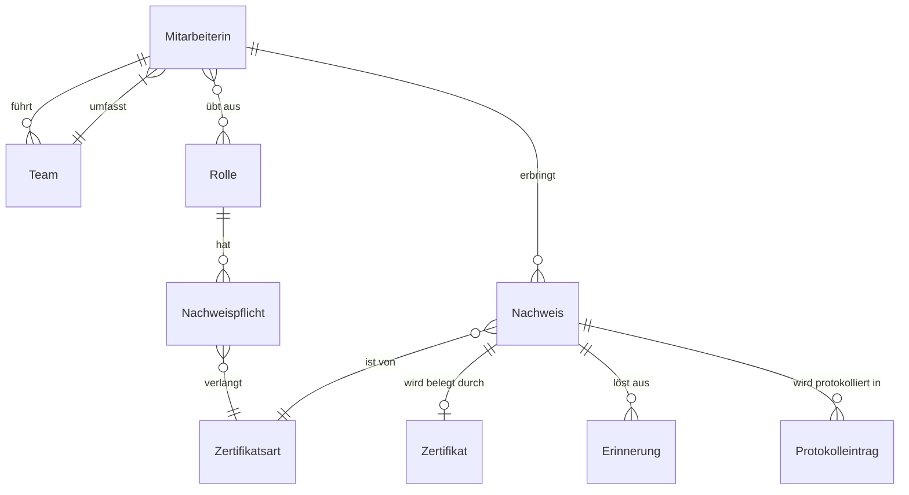

# 5 Glossar

> Eingeführt in V0.2 (in Arbeit)

Das Glossar legt fest, was die Begriffe im Pflichtenheft bedeuten. Jeder Begriff hat genau eine Bedeutung. Die Spalte «Nicht verwenden» nennt Synonyme, die im Pflichtenheft nicht vorkommen sollen.

Die meisten Begriffe stammen aus dem Event Storming (Kapitel 4). Die Unterscheidung zwischen «Zertifikat» und «Nachweis» geht auf den Hotspot H7 zurück.

## 5.1 Beteiligte

| Begriff | Definition | Nicht verwenden |
|---|---|---|
| Mitarbeiter:in | Person, die bei der Auftraggeberin angestellt ist und für ihre Rolle Nachweise erbringen muss. | User, Angestellte:r |
| Führungskraft | Mitarbeiter:in, die ein Team führt. Sie ist für die Nachweise ihres Teams verantwortlich und organisiert Erneuerungen. | Teamleiter, Vorgesetzte:r |
| Compliance-Manager:in | Person, die den Nachweisprozess im Unternehmen verantwortet. Sie legt Nachweispflichten fest, prüft sicherheitskritische Nachweise und erstellt Audit-Reports. | Compliance & Audit Manager, Compliance Manager |
| IT-Administrator:in | Person, die CertiKeep technisch betreibt und Benutzerkonten verwaltet. | Admin |
| HR | Personalabteilung. Sie erfasst Ein- und Austritte von Mitarbeiter:innen. | Personaldienst |
| Datenschutzberater:in | Person, die prüft, ob CertiKeep Personendaten nach dem Datenschutzgesetz (nDSG) bearbeitet. | Datenschutzbeauftragte:r |
| Externe Auditor:in | Person einer Aufsichtsstelle oder Zertifizierungsgesellschaft, die Nachweise im Rahmen eines Audits kontrolliert. | Prüfer:in |
| Team | Alle Mitarbeiter:innen, die einer Führungskraft unterstellt sind. | Gruppe |
| Abteilung | Organisatorische Einheit der Auftraggeberin. Sie kann mehrere Teams umfassen. | Bereich |

## 5.2 Fachbegriffe

| Begriff | Definition | Nicht verwenden |
|---|---|---|
| Rolle | Tätigkeit einer Mitarbeiter:in im Betrieb, zum Beispiel Staplerfahrer:in. An eine Rolle sind Nachweispflichten gebunden. Die Stakeholder in Kapitel 3 sind keine Rollen in diesem Sinn. | Funktion, Stelle |
| Zertifikatsart | Art eines Nachweises, zum Beispiel Staplerausweis, Erste-Hilfe-Kurs oder arbeitsmedizinische Tauglichkeit. Die Zertifikatsart legt die Vorwarnfrist fest und ob sie sicherheitskritisch ist. | Zertifikatstyp, Kategorie |
| Nachweispflicht | Festlegung, dass eine Rolle eine bestimmte Zertifikatsart braucht. | Pflichtschulung, Anforderung |
| Zertifikat | Dokument eines Ausstellers, zum Beispiel ein PDF oder ein Foto. Es bestätigt eine Schulung oder Prüfung. Ein Zertifikat ist ein Teil eines Nachweises. | Ausweis, Diplom |
| Nachweis | Eintrag in CertiKeep, der belegt, dass eine Mitarbeiter:in eine Nachweispflicht erfüllt. Ein Nachweis hat eine Zertifikatsart, ein Ablaufdatum und einen Status. In der Regel gehört ein Zertifikat dazu. | Qualifikation, Zertifikat (für den Eintrag) |
| Ablaufdatum | Letzter Tag, an dem ein Nachweis gültig ist. | Verfallsdatum, Gültigkeitsende |
| Vorwarnfrist | Anzahl Tage vor dem Ablaufdatum, ab der CertiKeep erinnert. Sie gilt pro Zertifikatsart. Die Compliance-Manager:in legt sie fest. Der Standardwert ist offen (siehe EZ-01). | Erinnerungsfrist, Vorlaufzeit |
| Sicherheitskritische Zertifikatsart | Zertifikatsart, deren Nachweise die Compliance-Manager:in vor der Freigabe prüft. Ein Beispiel ist der Staplerausweis. | – |
| Prüfung | Kontrolle eines neu erfassten Nachweises einer sicherheitskritischen Zertifikatsart durch die Compliance-Manager:in. | Validierung, Review |
| Freigabe | Ergebnis einer erfolgreichen Prüfung. Ab der Freigabe gilt der Nachweis als gültig. | Genehmigung |
| Erinnerung | Nachricht von CertiKeep an Mitarbeiter:in und Führungskraft, sobald ein Nachweis die Vorwarnfrist erreicht. | Warnung, Reminder |
| Eskalation | Nachricht von CertiKeep an die Compliance-Manager:in, wenn ein Nachweis kurz vor dem Ablaufdatum noch nicht erneuert ist. | Mahnung |
| Erneuerung | Ein neuer Nachweis derselben Zertifikatsart mit späterem Ablaufdatum ersetzt den bisherigen Nachweis. | Verlängerung |
| Audit-Report | Zusammenstellung aller Nachweise einer Abteilung für eine externe Prüfung. Der genaue Inhalt ist offen (siehe EZ-03). | Bericht, Export |
| Aufbewahrungsfrist | Zeitraum nach dem Austritt einer Mitarbeiter:in, in dem ihre Nachweisdaten aufbewahrt werden. Die Dauer ist offen (siehe EZ-03, H8). | Löschfrist |

## 5.3 Status eines Nachweises

Ein Nachweis hat immer genau einen Status.

| Status | Bedeutung |
|---|---|
| in Prüfung | Der Nachweis ist erfasst. Die Compliance-Manager:in hat ihn noch nicht geprüft. Nur bei sicherheitskritischen Zertifikatsarten. |
| abgelehnt | Die Compliance-Manager:in hat den Nachweis bei der Prüfung nicht freigegeben. |
| gültig | Der Nachweis ist freigegeben oder braucht keine Prüfung. Die Vorwarnfrist ist noch nicht erreicht. |
| fällig | Der Nachweis ist gültig, aber die Vorwarnfrist ist erreicht. |
| abgelaufen | Das Ablaufdatum ist vorbei, und es liegt keine Erneuerung vor. |
| erneuert | Ein neuerer Nachweis derselben Zertifikatsart hat diesen Nachweis ersetzt. |

## 5.4 Entity-Diagramm

Das Diagramm zeigt, wie die Begriffe zusammenhängen. Es ist ein fachliches Modell, kein Datenbankentwurf.

**Kardinalitäten kurz:**

- Eine Mitarbeiter:in kann kein, ein oder mehrere Teams führen. Ein Team umfasst mindestens eine Mitarbeiter:in.
- Eine Mitarbeiter:in kann mehrere Rollen ausüben, zum Beispiel Lager und Erste-Hilfe-Verantwortung.
- Eine Rolle hat null oder mehr Nachweispflichten. Jede Nachweispflicht verlangt genau eine Zertifikatsart.
- Ein Nachweis gehört zu genau einer Mitarbeiter:in und genau einer Zertifikatsart.
- Ein Nachweis hat höchstens ein Zertifikat. Bei der arbeitsmedizinischen Tauglichkeit wird kein Dokument gespeichert, nur das Ergebnis (siehe NFA-003).
- Jede Änderung an einem Nachweis erzeugt einen Protokolleintrag (siehe NFA-002).
